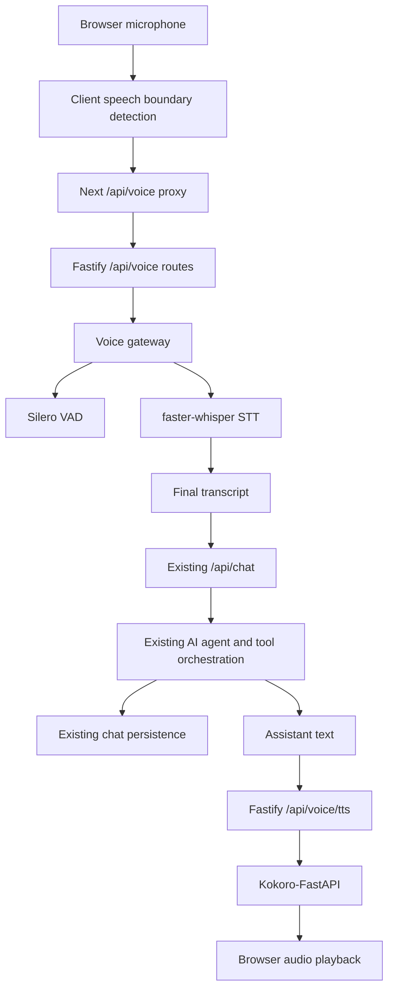

# Voice Conversation Architecture

Date: 2026-07-23

## Summary

The voice layer is implemented as speech input and speech output around the existing authenticated chat system. It does not replace the existing agent, tools, database persistence, chat sessions, or history. Voice transcripts are sent through the same `/api/chat` path used by text chat, so voice and text conversations share session state and persistence.



## Technology Choices

### Speech-to-Text

| Engine                            | Strengths                                                                                                                                                                    | Tradeoffs                                                                                   | Fit                                             |
| --------------------------------- | ---------------------------------------------------------------------------------------------------------------------------------------------------------------------------- | ------------------------------------------------------------------------------------------- | ----------------------------------------------- |
| faster-whisper                    | High accuracy from Whisper checkpoints, CTranslate2 acceleration, CPU int8, CUDA fp16/int8, integrated Silero VAD, good Python deployment, production community integrations | Not a native token-by-token ASR engine; live UX is usually chunked/utterance streaming      | Recommended default                             |
| whisper.cpp                       | Excellent embedded/offline C/C++ runtime, quantized models, broad CPU/GPU backends, VAD support, very low operational footprint                                              | More native build complexity for a web backend; Python service integration is less direct   | Best for edge or all-in-one native deployments  |
| NVIDIA Parakeet                   | Strong NVIDIA ASR family and GPU-oriented throughput                                                                                                                         | Less portable for CPU-only local deployment; model/runtime choices are more NVIDIA-specific | Consider for GPU-heavy production later         |
| WhisperX / WhisperLive / speaches | Useful wrappers around faster-whisper for alignment/live APIs                                                                                                                | More moving parts than this app needs initially                                             | Optional future replacement for the gateway API |

Recommendation: `faster-whisper` using `distil-large-v3` by default. Use CPU `int8` locally, CUDA `float16` or `int8_float16` in production when a GPU is available.

### Text-to-Speech

| Engine                        | Strengths                                                                                                                                                              | Tradeoffs                                                                                       | Fit                                             |
| ----------------------------- | ---------------------------------------------------------------------------------------------------------------------------------------------------------------------- | ----------------------------------------------------------------------------------------------- | ----------------------------------------------- |
| Kokoro 82M via Kokoro-FastAPI | Natural quality for size, OpenAI-compatible speech endpoint, streaming responses, CPU/NVIDIA/AMD images, active wrapper, multiple voices/languages, Apache-2.0 wrapper | Requires separate service and model/voice asset management                                      | Recommended default                             |
| Piper                         | Very fast local CPU TTS and many voices                                                                                                                                | Original repo archived; active OHF fork is GPL-3.0, which can be a product licensing constraint | Good for fully local GPL-compatible deployments |
| Coqui XTTS                    | Voice cloning and multilingual quality; documented streaming claims                                                                                                    | Main repo is stale and heavier to operate; licensing and cloning safety need review             | Not default for this app                        |

Recommendation: Kokoro-FastAPI behind the voice gateway. The Node app never exposes Kokoro URLs or secrets to the browser.

### Voice Activity Detection

| Engine     | Strengths                                                                                                    | Tradeoffs                                                               | Fit                           |
| ---------- | ------------------------------------------------------------------------------------------------------------ | ----------------------------------------------------------------------- | ----------------------------- |
| Silero VAD | Strong noisy-speech detection, small model, CPU-fast, ONNX/PyTorch ecosystem, integrated with faster-whisper | Server-side VAD adds one network hop if used alone                      | Recommended authoritative VAD |
| WebRTC VAD | Tiny, mature, very fast                                                                                      | More false positives in noisy environments; less robust than neural VAD | Useful as a fallback          |

Implementation uses two layers: lightweight browser RMS detection for immediate start/end UX and interruption, then Silero VAD in faster-whisper for authoritative speech filtering before transcription.

## Implemented Data Flow

1. User presses the microphone button in the existing chat composer.
2. Browser requests microphone permission and starts a `MediaRecorder` plus Web Audio analyser.
3. Client speech boundary detection starts recording when voice energy crosses the start threshold and stops after sustained silence or max utterance duration.
4. The recorded utterance is sent to `/api/voice/transcribe` through the existing same-origin Next proxy.
5. Fastify authenticates the request, validates MIME type and payload size, and forwards audio to the local voice gateway.
6. The voice gateway runs faster-whisper with Silero VAD enabled and returns the final transcript.
7. The client submits the transcript through existing `/api/chat`.
8. Existing chat orchestration executes tool calls and persists the exchange.
9. The client sends assistant text to `/api/voice/tts`.
10. Fastify authenticates and streams Kokoro audio bytes back to the browser.
11. Playback starts, then the UI returns to listening mode if voice mode is still active.

## UI States

The chat composer now exposes these voice states: `Idle`, `Listening`, `User speaking`, `Processing`, `AI thinking`, `Tool running`, `AI speaking`, `Error`, and `Disconnected`. The microphone button and compact status bar reflect those states without changing the existing chat layout.

## Interruption Handling

When speech starts while assistant output is active, the client stops current TTS playback immediately. If an AI request or typewriter animation is still active, the existing chat abort path is invoked. This keeps interruption latency local to the browser audio loop rather than waiting for the speech services.

## Streaming Notes

- Microphone capture is chunked locally through `MediaRecorder` and boundary-triggered VAD.
- TTS bytes are streamed from Kokoro through the voice gateway and Fastify route.
- The current existing `/api/chat` endpoint is non-streaming. The voice layer therefore speaks after the existing agent response completes. True token-level “speak while thinking” should be added by extending `llm-gateway` and `chat-orchestrator` with a streaming contract, not by duplicating tool logic in the voice layer.

## Latency Considerations

- Browser boundary detection avoids uploading silence and supports quick interruption.
- Server-side Silero VAD reduces transcription work and false submits.
- Use `distil-large-v3` or `turbo` for fast STT; use CUDA `float16` when available.
- Keep utterances short with `VOICE_MAX_AUDIO_BYTES` and a client max speech duration.
- Prefer MP3 for TTS over WAV for lower network transfer size.
- Warm the STT model on service startup in production if cold-start latency matters.

## Security

- Voice routes are behind existing Fastify auth.
- Browser only talks to same-origin Next routes.
- Audio MIME types and maximum payload size are validated in Fastify and again in the gateway.
- Speech service URLs remain server-side environment configuration.
- No provider secrets are exposed to the client.

## Scalability

- Run the voice gateway as a separate process or container from the Node API.
- Scale STT workers independently from the business API.
- Use GPU nodes for STT/TTS when concurrency grows.
- Put request size, per-user rate limits, and queue limits at the Fastify route or ingress layer.
- Keep one Kokoro service pool per GPU profile; voices are selected per request.

## Edge Cases

- Microphone permission denied or missing device.
- Device already in use.
- Unsupported `MediaRecorder` MIME type.
- User speaks over assistant playback.
- Very short utterances or background noise.
- Oversized audio payload.
- STT gateway timeout or malformed response.
- TTS gateway timeout or playback failure.
- Existing chat auth expiration.
- Tool failure from the existing orchestrator.

## Deployment Recommendation

Development:

```powershell
# Terminal 1: Kokoro-FastAPI on http://localhost:8880
# Terminal 2: Voice gateway
cd voice.cocomama
python -m venv .venv
.\.venv\Scripts\Activate.ps1
pip install -r requirements.txt
uvicorn voice_gateway.main:app --host 0.0.0.0 --port 8010

# Terminal 3: Existing backend with VOICE_GATEWAY_BASE_URL=http://localhost:8010
npm.cmd --prefix server.cocomama run dev

# Terminal 4: Existing client
npm.cmd --prefix client.cocomama run dev
```

Production:

- CPU-only small deployment: `VOICE_STT_MODEL=distil-large-v3`, `VOICE_STT_DEVICE=cpu`, `VOICE_STT_COMPUTE_TYPE=int8`.
- NVIDIA deployment: `VOICE_STT_DEVICE=cuda`, `VOICE_STT_COMPUTE_TYPE=float16`, run Kokoro GPU image.
- Docker Compose deployment: use the root `docker-compose.yaml`; it runs `client`, `backend`, `voice`, and `postgres`, with backend migrations executed before the backend server starts.
- Add ingress limits for `/api/voice/transcribe`, per-user quotas, and observability around transcription duration, TTS duration, gateway errors, and interruption rate.
